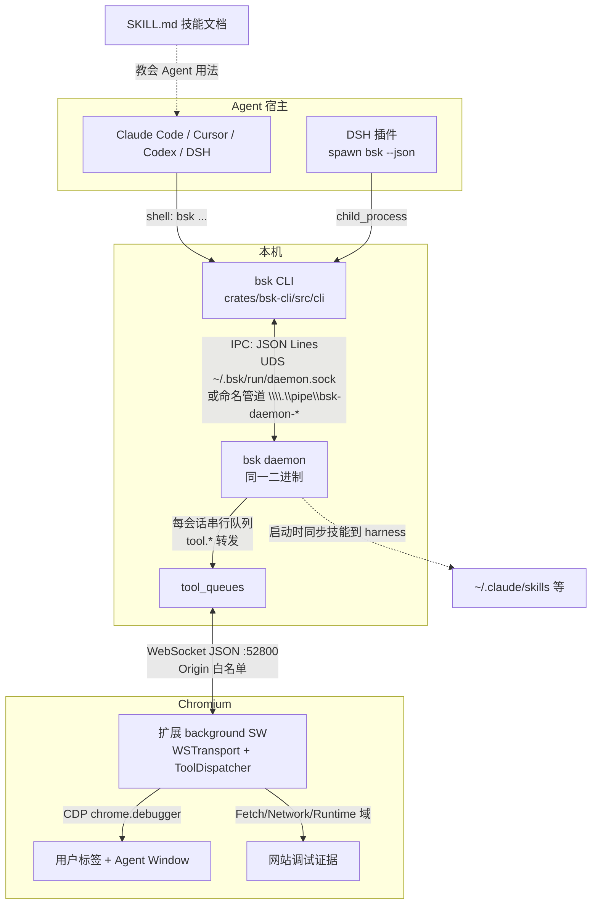
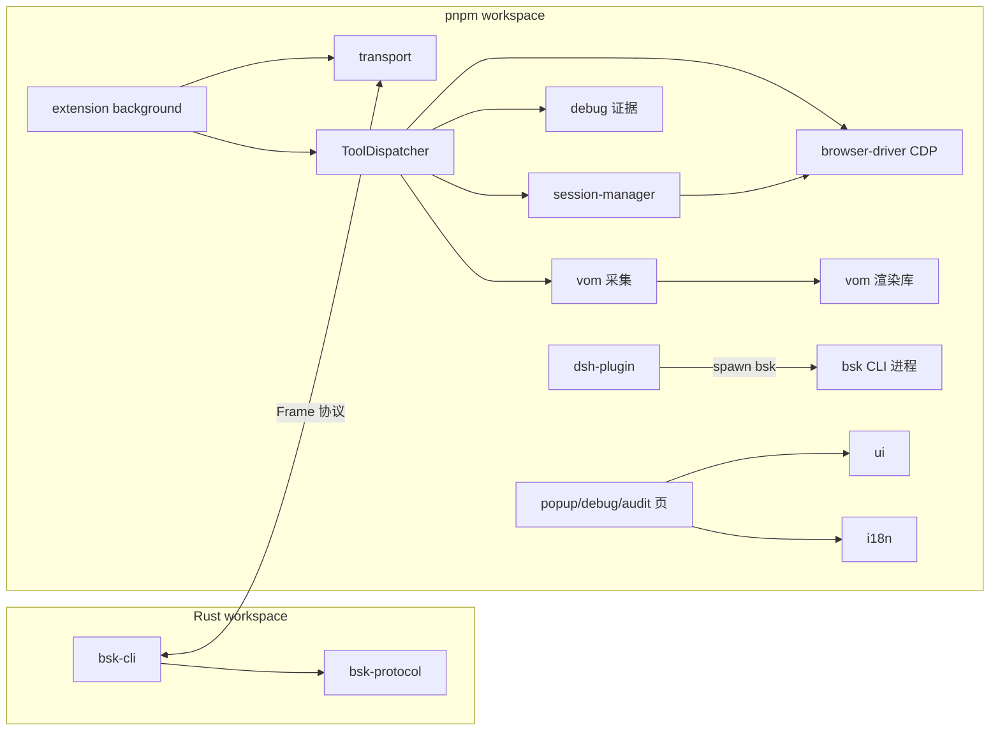

# BrowserSkill - 架构分析

> 生成时间: 2026-09-27 · 分析版本: v0.3.1 (commit 8cbcc49)

## 1. 项目概览

### 1.1 项目信息

| 项目 | 内容 |
|------|------|
| 名称 | BrowserSkill（腾讯开源） |
| 仓库 | https://github.com/Tencent/BrowserSkill |
| 语言 | Rust + TypeScript（pnpm monorepo + Cargo workspace） |
| 类型 | AI Agent 浏览器自动化工具链（CLI + 常驻 daemon + 浏览器扩展 + 插件） |
| 许可证 | MIT |
| 描述 | 让 AI Agent（Claude Code / Cursor / Codex / DeepSeek Harness 等）连接到用户已登录的 Chrome/Edge 浏览器，读取页面、填表、截图、调试网站。任务运行在独立可见的 Agent Window 中，支持借用并归还已有标签页 |

**核心链路**：Agent 以 shell 方式调用 `bsk` CLI → CLI 经 IPC（UDS/命名管道）连接常驻 daemon → daemon 经 WebSocket（默认 52800 端口）转发给浏览器扩展 → 扩展通过 CDP（chrome.debugger）驱动页面。

### 1.2 代码规模

| 组件 | 文件数 | 代码行数 | 说明 |
|------|--------|----------|------|
| crates/bsk-cli + bsk-protocol（Rust） | 148 | ~53,100 | CLI 与 daemon 同一二进制 `bsk` |
| apps/extension（TS/TSX） | 389 | ~108,800 | **最大组件**，WXT MV3 扩展 |
| packages/dsh-plugin-browserskill | 59 | ~17,600 | DeepSeek Harness 插件（npm 包） |
| packages/vom | 8 | ~3,300 | 页面语义快照渲染库（零依赖） |
| evals/browser | 30 | ~2,800 | 浏览器能力评测集 |
| packages/i18n / packages/ui | 15 | ~800 | 10 语言本地化 / shadcn 风格组件库 |

### 1.3 仓库目录结构

```
BrowserSkill/
├── apps/
│   └── extension/              # WXT 构建的 Chromium MV3 扩展（React 19 + Tailwind v4）
│       └── src/
│           ├── entrypoints/    # background SW / content scripts / popup / debug 页 / audit 页
│           ├── transport/      # 可插拔 Transport（v1: WSTransport）
│           ├── tools/          # ToolDispatcher → ~40 个 tool.* 处理器
│           ├── session-manager/# 会话、Agent Window、ref-store(@eN)、tab 借用
│           ├── browser-driver/ # chrome.debugger CDP 封装（flat session、OOPIF frame 树）
│           ├── debug/          # 网站调试证据采集（网络/console/性能/规则/重放）
│           ├── long-screenshot/# 长截图（滚动分块 + PNG 拼接）
│           └── content/        # Agent Window 内的控制遮罩等 overlay
├── crates/
│   ├── bsk-cli/                # `bsk` 二进制（CLI + daemon 同体）
│   │   ├── src/cli/            # Clap 命令树 + 各子命令处理
│   │   ├── src/daemon/         # daemon 全部逻辑（IPC/WS/会话/队列/审计/远程网关）
│   │   ├── src/skill_install/  # 技能安装到 12 种 agent harness
│   │   └── skill/              # 内置 SKILL.md + references/（编译期嵌入）
│   └── bsk-protocol/           # 线协议类型 + JSON Schema 生成（dump-schema）
├── packages/
│   ├── dsh-plugin-browserskill/# DSH 插件（双面 npm 包：host Cordis 插件 + client UI）
│   ├── i18n/                   # i18next 封装，10 种语言
│   ├── ui/                     # 基础组件库（源码直出，无构建）
│   └── vom/                    # VOM 页面快照渲染模型（CDP-free 纯数据+渲染库）
├── docs/                       # architecture / website-debugging / remote 等文档
├── evals/browser/              # 数据驱动的浏览器评测集（core/matrix 用例）
├── install.sh / install.ps1    # CLI 安装器（GitHub Releases + SHA256 校验）
└── Cargo.toml / pnpm-workspace.yaml
```

## 2. 架构设计

### 2.1 架构模式

**分层中转（hub-and-spoke）+ 单二进制双角色 + 协议单一事实源**：

- **分层**：Agent（shell）→ CLI（进程边界）→ daemon（常驻服务）→ 扩展（浏览器边界）→ CDP（Chromium 边界）。每层只信任相邻层。
- **daemon 是纯中转与策略层**：不直接操作浏览器，只做会话路由、串行队列、取消传播、传输暂存、审计与安全校验；浏览器操作全部在扩展内经 CDP 完成。
- **单二进制双角色**：CLI 与 daemon 是同一个 `bsk` 可执行文件，靠 `BSK_DAEMONIZED=1` 环境变量 + `daemon.lock` 排他锁 + `daemon.json` 发现文件区分角色，CLI 在需要时自动拉起 daemon。
- **协议单一事实源**：`bsk-protocol` crate 用 Rust 类型定义全部帧/方法/参数，经 `dump-schema` 生成 JSON Schema；TS 侧 `apps/extension/src/transport/types.ts` 手工镜像并通过测试与 schema dump 保持同步。
- **扩展侧插件化**：`Transport` 接口抽象了 daemon 连接方式（v0.1 只有 WSTransport，可替换为 native messaging 而不动其他代码）。

### 2.2 系统架构图



### 2.3 核心模块职责

#### Rust 侧（crates/）

| 模块 | 职责 | 关键文件 |
|------|------|----------|
| `cli/` | Clap 命令树（~30 个动词-名词子命令）、`--json` 渲染、错误与退出码 | `crates/bsk-cli/src/cli/mod.rs`（Command 枚举 L108-232） |
| `ipc_client.rs` | CLI 侧 IPC 客户端：一行一帧 JSON，Unix/Windows 双实现、对端 PID 验证 | `crates/bsk-cli/src/ipc_client.rs` |
| `daemon/start.rs` | daemon 启动/停止/自更新重启；分离 spawn；idle 退出；文件日志 | `crates/bsk-cli/src/daemon/start.rs`（run_foreground L323-545） |
| `daemon/ipc.rs` | IPC 服务器 + full_handler RPC 分发（system/session/browser/transfer/tool.*/cancel） | `crates/bsk-cli/src/daemon/ipc.rs` |
| `daemon/ws.rs` | WS 服务器：Origin 校验、handshake、BrowserClient 注册、pump 循环 | `crates/bsk-cli/src/daemon/ws.rs` |
| `daemon/queue.rs` | **每会话容量 64 的 mpsc 串行队列**——同会话工具调用严格串行（ref-store 安全） | `crates/bsk-cli/src/daemon/queue.rs` |
| `daemon/sessions.rs` / `session_requests.rs` | 会话注册表（4 字母 ID）；可恢复的 `session.start_tracked`（令牌含准入期限） | `crates/bsk-cli/src/daemon/sessions.rs` |
| `daemon/file_transfer.rs` | 上传/下载暂存：不透明 capability id、512KiB 分块、512MB/20 文件上限、防符号链接逃逸 | `crates/bsk-cli/src/daemon/file_transfer.rs` |
| `daemon/audit.rs` | 本地操作审计（~/.bsk/audit，30 天保留、元数据白名单、不含输入值） | `crates/bsk-cli/src/daemon/audit.rs` |
| `daemon/remote/` | server 模式：TLS 网关、设备配对/续期/吊销、限流 | `crates/bsk-cli/src/daemon/remote/` |
| `skill_install/` | 技能安装/同步到 12 种 harness（ClaudeCode、Cursor、Codex、OpenClaw…），原子事务 + `.bsk-source` 清单 | `crates/bsk-cli/src/skill_install/` |
| `windows_process.rs` | Windows 原生 CreateProcessW 封装（显式句柄继承白名单、Job Object 逃逸验证） | `crates/bsk-cli/src/windows_process.rs` |
| **bsk-protocol** | 帧格式、方法枚举、错误码、~20 组工具参数/结果类型 + JSON Schema | `crates/bsk-protocol/src/` |

#### 协议层（bsk-protocol）

- **三种帧**（`frame.rs`）：`Request {id, method, params?}` / `Response {id, result|error}`（互斥，违反报 `AmbiguousResponse`）/ `Event {event, payload}`。`RpcId` 为 12 位随机 hex。同一 Frame 协议同时跑在 IPC（按行分隔）和 WS（按消息分隔）上。
- **事件**：`system.heartbeat`（扩展 20s 心跳，兼作 MV3 SW 保活）、`session.activity`、`session.window_closed`、`session.user_interrupt`、`browser.connected/disconnected`、`audit.context`。
- **~40 个 `tool.*` 方法**（`method.rs`），每个方法都有编译期强制的**副作用分类**（`MethodEffect`：`PassiveRead` / `TransientInput` / `BrowserMutation` / `ControlPlane`，match 无兜底分支，新增方法必须显式分类）。该分类驱动"用户点停止后，下一个变更类调用被拒为 `user_aborted`"的中断门控。
- **错误码**（`error.rs`）：`user_aborted` 与 `cancelled` 分离；另有 `version_too_old`、`multiple_browsers_online`、`no_browser_connected` 等。
- **版本协商**（`system.rs`）：只比 protocol_version（当前 `"1.3"`），major 不同或低于 `1.0` 拒绝；minor 差异为 Skew 警告放行。

#### 扩展侧（apps/extension）

| 模块 | 职责 |
|------|------|
| `entrypoints/background.ts` | 总装配（560 行）：transport、SessionManager、ToolDispatcher、DebugManager、overlay 状态机、keepalive/心跳、MV3 唤醒重连 |
| `transport/` | `WSTransport`（指数退避重连 1s→5s）、handshake、远程模式端点解析与授权 |
| `tools/dispatcher.ts` | 将 ~40 个 `tool.*` 方法路由到各 handler（1078 行） |
| `session-manager/` | 会话/Agent Window 创建、`@eN` ref-store、tab 借用预约表、断连清理 |
| `browser-driver/chromium-cdp.ts` | chrome.debugger CDP 封装：flat session（寻址 OOPIF，要求 Chromium 125+）、console/网络捕获 |
| `debug/` | 网站调试：CDP Network 域请求/响应体捕获（512KB 上限）、Fetch 域规则（block/modify/mock，上限 32 条）与重放（上限 20 次）、性能观察器、脱敏、本地留存（50 条/50MiB/30 天） |
| `long-screenshot/` | 滚动分块截图 + PNG 拼接 + 预览页/导出 worker |
| `content/` + `entrypoints/content.ts` | Shadow DOM overlay：Agent 控制遮罩（含停止按钮）、tab 借用确认、人类协助请求、录制提示 |

#### DSH 插件（packages/dsh-plugin-browserskill）

"双面包"npm 包：host 面 `lib/index.mjs` 是 Cordis 插件（注册 6 个模型可见工具：`browser_session/page/inspect/interact/tabs/assist`）；client 面 `lib/client.cjs` 是 dsh Web UI 模块（任务预览 PiP 浮窗、截图卡片、SSE 观察流）。每个动作 spawn 一次 `bsk <cmd> --json` 子进程；延迟注册（lazyTools）——六个工具 schema 在技能被成功调用后才进入系统提示。

#### 共享包

| 包 | 职责 |
|----|------|
| `packages/vom` | **V**iew **O**bject **M**odel：CDP-free 纯数据+渲染库。扩展把 CDP Accessibility 语义与 DOMSnapshot 几何按 backendNodeId 连接成 `VomScene`，本库渲染为模型可读文本 + `@eN` 引用（token 预算、遮挡层检测、表单值掩码）。零运行时依赖，`tool.observe`/`tool.snapshot` 的核心 |
| `packages/i18n` | i18next 封装 + chrome.storage 同步，10 种语言（含 zh-TW/ja-JP/fr-FR 等） |
| `packages/ui` | shadcn 风格基础组件（button/card/input…），源码直出无构建 |

### 2.4 会话与沙箱模型

- **Session** = 4 字母随机 ID + 专属 **Agent Window** + 会话级 ref-store + 借用表。
- **沙箱规则**：写工具只能作用于 Agent Window 内的标签，除非该标签是从用户 profile **借用**的（借用需用户确认，overlay 或系统通知双通道）。
- 多会话 = 多 Agent Window，完全隔离；同会话 RPC 串行，跨会话并行。
- `bsk session stop` 是 agent 工作流中的强制步骤；空闲 5 分钟超时是兜底。
- `tab_list` 三种 scope：`user`（默认）/ `agent`（仅当前 Agent Window）/ `all`。

## 3. 依赖关系分析

### 3.1 Rust 外部依赖（workspace 级）

| 依赖 | 版本 | 用途 |
|------|------|------|
| tokio | 1 (full) | 异步运行时（daemon 多线程 runtime） |
| tokio-tungstenite | 0.24 | daemon ↔ 扩展 WebSocket |
| serde / serde_json | 1 | 协议序列化 |
| schemars | 0.8 | JSON Schema 生成（协议单一事实源） |
| clap | 4 (derive) | CLI 命令树 |
| reqwest | 0.13 (rustls) | 自更新下载 / GitHub API |
| fs2 | 0.4 | daemon.lock 内核级排他锁 |
| flate2 / tar / zip / sha2 | — | 安装包解压与校验 |
| nix | 0.29 | **仅 Unix**（信号、setsid） |
| windows-sys | 0.59 | **仅 Windows**（JobObjects/Threading/Pipes） |
| dialoguer / console | — | install-skill 交互式选择 |
| dirs | 5 | `~/.bsk` 主目录 |
| tracing (+subscriber/appender) | — | JSON 滚动文件日志 |

### 3.2 TypeScript 依赖（按包）

| 包 | 运行时依赖 | 构建/测试 |
|----|-----------|-----------|
| apps/extension | react 19、@browser-skill/{i18n,ui,vom}（workspace）、@remixicon/react、re2js（规则 URL 匹配） | WXT 0.20（Vite 内核）、Tailwind v4、Vitest 4 + happy-dom |
| dsh-plugin | peer: @deepseek-ai/cordis 4、dsh-{attachment,client-ui-*,llm,tools}、schemastery、react 18（均可选） | tsdown 0.22 双配置、lightningcss + 前缀隔离、Vitest 4 |
| packages/vom | **零依赖** | Vitest |
| packages/i18n | i18next 24、react-i18next | Vitest |
| packages/ui | cva、clsx、tailwind-merge | 无 |

### 3.3 模块依赖图



**关键解耦点**：
- `bsk-protocol` 无 IO 依赖，可独立发布（daemon 的可发布依赖方需要版本号）。
- 扩展内部四个内部包（vom/ui/i18n + extension）均以 TS 源码形式经 Vite alias 消费，无构建产物依赖。
- DSH 插件与 CLI 的唯一耦合是子进程 + `--json` 输出 + skill 文档，升级解耦。

## 4. 设计亮点与模式

1. **副作用分类编译期强制**（`method.rs`）：新增 `tool.*` 方法不写 effect 分类无法编译，中断安全不依赖人工纪律。
2. **不透明 capability 模式**：长截图（capture_id + 分块 read/release）、文件传输（transfer id + 暂存路径注入）都避免把宿主路径暴露给浏览器侧；daemon 是存储权限与限额的唯一权威。
3. **防 PID 复用的停止链**：`daemon.json` 的 pid 必须与 IPC 对端凭据（UDS peer_cred / GetNamedPipeServerProcessId）一致才允许发终止信号。
4. **可恢复会话启动**：`session.start_tracked` 令牌含准入期限 + UUID，过期不可重启，防延迟请求"复活"。
5. **技能即代码**：SKILL.md 编译期嵌入二进制，`.bsk-source` 清单记录每文件 SHA-256，自动更新先校验全部受管文件与新路径碰撞再替换，中断可恢复。
6. **协议镜像测试**：Rust ↔ TS 类型靠 schema dump + 双侧测试锁定（如 `2^53-1` 协议版本上限与 TS `Number.isSafeInteger` 对齐）。

## 5. 数据与状态文件

| 位置 | 内容 |
|------|------|
| `~/.bsk/daemon.lock` | fs2 排他锁（单例 daemon） |
| `~/.bsk/daemon.json` | `{sock_path, pid, ws_port, version}`（原子写） |
| `~/.bsk/daemon.log` | 每日滚动 JSON 日志 |
| `~/.bsk/run/daemon.sock` | Unix IPC 端点（Windows 用命名管道替代） |
| `~/.bsk/audit/` | 操作审计（可选，30 天） |
| `~/.bsk/transfers staging` | 文件传输暂存（会话级生命周期） |
| `~/.bsk/record-session.json` 等 | 录制状态与崩溃恢复 |
| 浏览器 profile 内 IndexedDB | 网站调试历史（50 条/50MiB/30 天）、远程设备凭据 |

## 6. 测试与质量体系

| 层 | 内容 |
|----|------|
| Rust 单测 | `cargo test --workspace --locked`（daemon 竞态、锁、协议、技能安装迁移有大量防御性测试） |
| Windows 专用集成测试 | `tests/windows_daemon_start.rs`（14 用例）、`windows_update.rs`、`windows_parent_cancel.rs` |
| 扩展测试 | Vitest 4 + happy-dom（含 `.browser.test.ts` 变体） |
| DSH 插件测试 | Vitest（client 侧钉 react 18 匹配宿主） |
| 评测集 | `evals/browser`：数据驱动用例 + fixture 页面 + `pnpm eval:browser smoke` 真实端到端 |
| CI | GitHub Actions：ubuntu + windows-latest 多 job；安装器在 PS 5.1 与 PS 7 各跑一遍 |
| Lint | Biome + stylelint + clippy/rustfmt |

## 7. 结论

BrowserSkill 是一个**工程成熟度很高的多语言 monorepo**：协议有单一事实源并编译期锁定副作用语义；daemon 对启动竞态、PID 复用、并发 starter、崩溃恢复做了系统性防御；安全边界（沙箱、借用确认、传输 capability、脱敏、审计）贯穿全链路；Windows 不是"移植目标"而是与 Unix 对等的一等实现。扩展侧（~109K 行）承载了最多的浏览器领域复杂度（CDP、OOPIF、MV3 生命周期、网站调试证据模型），是理解本项目的最深水域。
