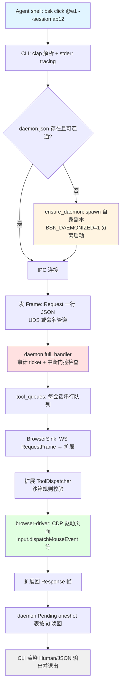
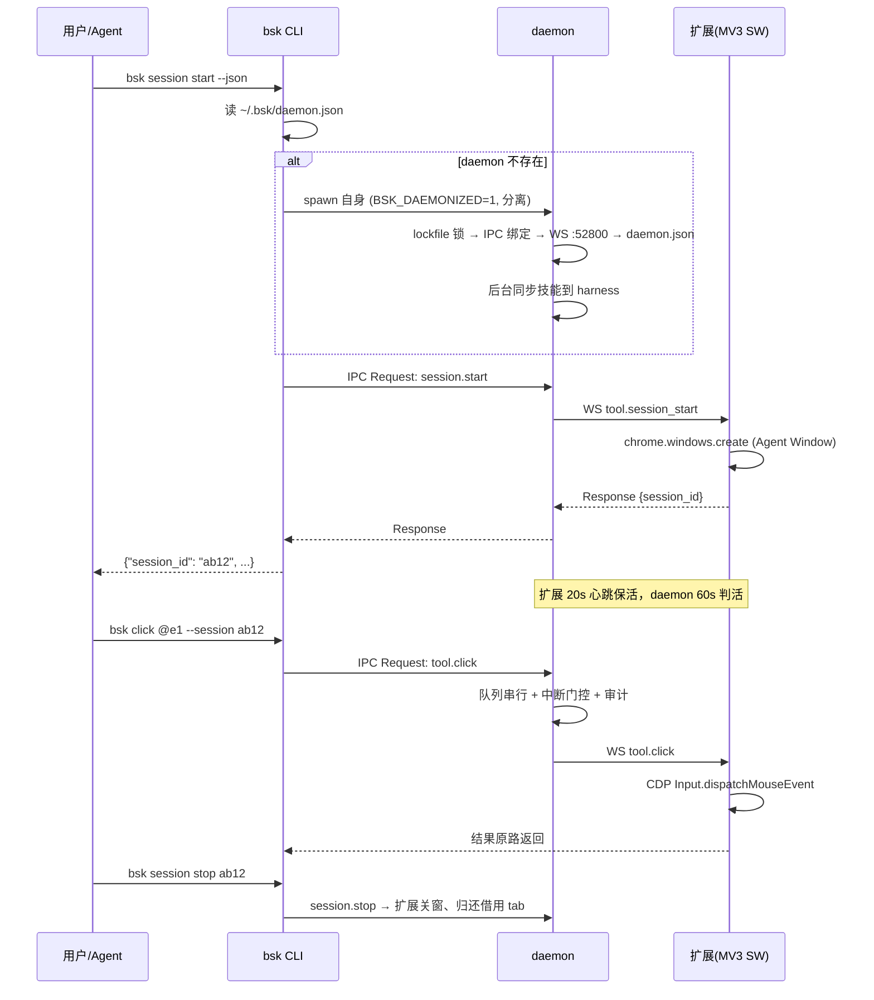

# BrowserSkill - 运行机制详解

> 生成时间: 2026-09-27 · 分析版本: v0.3.1 (commit 8cbcc49)

## 一、项目运行方式

BrowserSkill 不是单一应用，而是**三进程协作体系**：`bsk` CLI（短命进程）+ `bsk` daemon（常驻后台，与 CLI 同一二进制）+ 浏览器扩展（MV3 service worker）。启动顺序上用户只需安装 CLI 与扩展；daemon 由 CLI 按需自动拉起。

### 1. 安装与执行

```sh
# 安装 CLI（macOS/Linux）
curl -fsSL https://raw.githubusercontent.com/Tencent/BrowserSkill/main/install.sh | sh
# Windows PowerShell
irm https://raw.githubusercontent.com/Tencent/BrowserSkill/main/install.ps1 | iex

# 浏览器安装扩展（Chrome/Edge 商店），扩展 popup 中启用本地连接

# 安装技能到 agent harness（交互式选择，或 --harness cursor --json）
bsk install-skill

# 诊断连接
bsk doctor

# 典型使用（agent 实际执行的命令序列）
bsk session start --no-focus --json     # 拿到 session_id
bsk navigate https://example.com --session <id>
bsk observe --session <id>
bsk screenshot --session <id> --out page.png
bsk session stop <id>
```

### 2. 一次工具调用的完整执行流程



## 二、核心运行机制

### 2.1 单二进制双角色与 daemon 自动拉起

**位置**: `crates/bsk-cli/src/main.rs` L9-113、`crates/bsk-cli/src/daemon/start.rs` L127-205

CLI 与 daemon 是同一可执行文件。非 `daemon` 子命令走 CLI 路径；当 IPC 探测发现没有就绪 daemon 时（且 `BSK_AUTO_START != 0`）：

1. 父进程 spawn 自身副本并设置 `BSK_DAEMONIZED=1`；
2. 子进程检测到该变量后 `detach_stdio()`（Unix: /dev/null + setsid；Windows: 父进程已提供 NUL 句柄），进入 `run_foreground`；
3. **Windows 分离细节**（`daemon/start/windows.rs` L42-55）：`DETACHED_PROCESS | CREATE_NEW_PROCESS_GROUP | CREATE_BREAKAWAY_FROM_JOB | CREATE_SUSPENDED` 四标志联合；先挂起创建，用 `IsProcessInJob` 验证子进程确实逃出了宿主 Job Object 后才 `ResumeThread`，失败则杀死挂起子进程并输出 `DETACH_HINT` 指引（fail-closed）；
4. 父进程轮询 `probe::wait_for_ready` 等待就绪；超时只 disown 子进程、绝不误杀可能被其他客户端复用的 daemon。

**关键环境变量**：`BSK_DAEMONIZED=1`（角色标记）、`BSK_DAEMON_REPLACES_PID`（自更新接力：新 daemon 等旧 pid 退出以继承锁/端口）、`BSK_AUTO_START=0`（禁用隐式启动，用于沙箱宿主）、`BSK_HOME`（覆盖 `~/.bsk`）。

### 2.2 daemon 主生命周期

**位置**: `crates/bsk-cli/src/daemon/start.rs` L323-545（`run_foreground`）

启动序列：

1. `ensure_bsk_home`（Unix 0700）+ `init_tracing`（每日滚动 JSON 文件日志）；
2. `lockfile::acquire()` —— `~/.bsk/daemon.lock` 上的 fs2 内核级排他锁，进程退出自动释放；已锁则报 `AlreadyLocked`；
3. 建 tokio 多线程 runtime；绑定 IPC（Unix UDS / Windows 命名管道 `\\.\pipe\bsk-daemon-<hash>`，hash 覆盖 USERNAME+BSK_HOME，规避特殊用户名的 NPFS 问题，issue #75）；
4. `DaemonState::new`；启动三个后台任务：**session-idle reaper**（空闲会话收割，默认 5 分钟）、**browser-liveness reaper**（60 秒无心跳判假死，15 秒 tick）、**update-check task**（自更新检查，会话活跃时推迟）；
5. 绑定 WS 服务器（默认 52800，loopback）→ 原子写 `daemon.json`；
6. 后台同步 agent 技能（`sync_installed_skills`，见 §2.6）；
7. `tokio::select!` 等待退出信号：Ctrl-C / **idle 退出**（无 IPC 连接 + 无浏览器 + 无会话时）/ 自更新重启请求；
8. 优雅关停（顺序）：IPC → reapers → update task → WS → 删除 `daemon.json` 与 socket 文件。

### 2.3 三条通信链路与帧协议

| 链路 | 传输 | 帧承载 | 说明 |
|------|------|--------|------|
| CLI → daemon | UDS（Unix）/ 命名管道（Windows） | **一行一个 JSON 帧**（newline-delimited） | `ipc_client.rs`：写一行读一行，校验 id 一致；Windows `ERROR_PIPE_BUSY` 以 50ms 重试、总预算 5s |
| daemon → 扩展 | WebSocket（默认 `ws://127.0.0.1:52800`；远程模式 WSS 网关） | **一个 WS 文本消息一个 JSON 帧** | `ws.rs`：升级时校验 Origin 必须为 `chrome-extension://<32位id>`；连接后第一帧必须是 `system.handshake`（5s 超时） |
| DSH 插件 → CLI | `child_process.spawn` 子进程 | `--json` stdout | 每个 action 一个短命进程；取消走 stdin EOF + `BSK_CANCEL_ON_STDIN_CLOSE=1`（Windows 无法转发 Ctrl-C 的替代通道） |

三种帧形状（`bsk-protocol/src/frame.rs` L67-72）：
- `Request {id, method, params?}` —— `id` 为 12 位随机 hex；
- `Response {id, result}` 或 `{id, error}` —— result 与 error 互斥；
- `Event {event, payload}` —— 心跳、会话活动、用户中断、浏览器上下线等。

**握手与版本协商**（`ws.rs` L253-297 + `protocol/system.rs` L42-100）：只比较 protocol_version（当前 `"1.3"`）；major 不同或对端低于 `1.0` → Reject 断连；同 major 不同 minor → Skew 警告放行。协议 major 上限 `2^53-1`，与 TS 侧 `Number.isSafeInteger` 对齐。

**扩展侧连接管理**（`apps/extension/src/transport/`）：`WSTransport` 指数退避重连（1s→2s→4s…上限 5s）；`ConnectionController` 管理 transport+handshake 生命周期并把快照推给 popup；MV3 SW 保活双保险——`chrome.alarms` 30s 唤醒 + 应用层 20s 心跳（兼作 daemon 判活信号）；`chrome.idle.onStateChanged` 睡醒重连。

### 2.4 会话路由与每会话串行队列

**位置**: `crates/bsk-cli/src/daemon/queue.rs`、`ipc.rs` L340+

- daemon 维护 `browsers`（已连接扩展）与 `sessions`（Agent Window 绑定）两个注册表；
- 每个 session 一条**容量 64 的 mpsc 队列 + worker 任务**：同会话工具调用严格串行（保护扩展侧 ref-store 与调试器状态），不同会话并行；
- worker 经 `BrowserSink`（unbounded mpsc → WS 写任务）转发 Request，并在 `Pending` 表（oneshot）按 id 等待扩展响应；
- 扩展重连用 **generation 计数**防竞态：只有当前代次的断开才清除注册并 purge 会话；
- 多浏览器在线时 `session start --browser <id|名称>` 显式选择。

**典型调用链**（`docs/architecture.md`）：
`bsk click @e1 --tab-id 42 --session ab12` → CLI 确保 daemon → IPC 一行请求 → daemon 解析 session `ab12` → 浏览器连接 → WS `tool.click` → 扩展 dispatcher 校验沙箱 → CDP `Input.dispatchMouseEvent` → 响应原路返回。

### 2.5 取消与用户中断（三层取消链）

**位置**: `cli/business_rpc.rs`、`daemon/inflight.rs`、`daemon/cancel_forward.rs`、`daemon/session_interrupt.rs`

```
① CLI Ctrl-C ──► 新 IPC 连接发 cancel {rpc_id}（2s 宽限后本地合成 cancelled）
② daemon handle_cancel ──► AbortRegistry（daemon 本地长任务如 wait_ms）
                        ──► ToolInflightRegistry（Queued 阶段直接短路）
                        ──► cancel_forward（已 Forwarded 则向扩展推 WS cancel 帧）
③ 扩展 AbortController 中止浏览器侧操作
```

**用户中断门控**（独立的第三机制）：用户在浏览器点 Agent Window 的停止按钮 → 扩展发 `session.user_interrupt` Event → daemon 的 `SessionInterruptRegistry` 打一次性标记 → 下一个副作用分类为 `BrowserMutation`（或 `tool.debug` 的 rule/replay 动作）的方法被拒为 `user_aborted`（错误码区别于 `cancelled`）；读操作与会话拆解不受影响。副作用分类在 `method.rs` 由 `MethodEffect` 编译期强制，新增方法漏分类无法编译。

### 2.6 技能安装与同步机制

**位置**: `crates/bsk-cli/src/skill_install/`

- `SKILL.md` 与 `references/` 在**编译期内嵌**进二进制（`include_str!` + build.rs 收集）；
- `bsk install-skill`：交互式 MultiSelect 选择目标 harness；支持 **12 种**：Codex、ClaudeCode、Cursor、OpenClaw、Codebuddy、Workbuddy、PiAgent、Hermes、KimiCode 等，各自技能目录（如 `~/.claude/skills`、`~/.kimi-code/skills`）+ 本机检测启发式；
- 安装是**原子事务**：`.bsk-source` 清单记录每文件 SHA-256；更新前校验所有受管文件未被动过、检查新路径碰撞；资源先于入口写入；pending manifest 记录新旧哈希，中断可恢复；用户自定义安装（custom）受保护不被覆盖；
- daemon 每次启动、`session start`、`doctor` 时后台同步（`sync_installed_skills`）。

### 2.7 会话与 Agent Window（扩展侧）

**位置**: `apps/extension/src/session-manager/`、`apps/extension/src/tools/tabs.rs`

- `session_start`：`chrome.windows.create` 创建 Agent Window（首页 `about:blank`，因 chrome:// 页拒绝 CDP 导航）；窗口尺寸校验 100..7680；启动清理是事务化的（`SessionStartCleanupError` 带回滚）;
- **tab 借用**：`tool.tab_borrow` 把用户标签 `chrome.tabs.move` 移入 Agent Window（带回滚）；必须先经用户批准——优先在用户当前窗口渲染 `BorrowConfirmationOverlay`，content script 不可用时回退到 OS 级 `chrome.notifications`（带 Allow/Deny 按钮）；扩展设置 `confirmTabBorrow` 关闭时可自动放行；
- `ref-store`：维护 `@e1` 式元素引用，snapshot/observe 产出、后续 click/fill 消费；这是同会话必须串行的根因；
- 断连清理（`disconnect-cleanup.ts`）：daemon 掉线时的会话状态收敛；
- 会话停止/窗口关闭 → 借用的 tab 归还原窗口。

### 2.8 大数据传输：不透明 capability 模式

**长截图**（`protocol/tools/observation.rs` L259-314 + `cli/screenshot.rs` L120-150）：
`screenshot_full_page` 返回**不透明 capture_id**（不是路径）→ CLI 分块 `screenshot_read`（每块 ≤256KiB base64）→ 原子写盘 → 必然 `screenshot_release`。实际滚动与 PNG 拼接在扩展 `long-screenshot/`（tile 采集 + png.ts 拼接 + frame-freshness 校验）。

**文件上传/下载**（`daemon/file_transfer.rs`）：
- CLI 是唯一读上传源/写下载目的的组件；扩展永远拿不到 agent 侧路径；
- daemon 签发**会话级不透明 transfer id**，512KiB 分块暂存于私有运行时目录，512MB 总量、20 文件上限，路径能力校验防符号链接逃逸；
- 上传走 Chrome chooser 拦截（`Page.fileChooserOpened` + `DOM.setFileInputFiles`）或原生 drop 事务（OOPIF 用 target-local 坐标）；下载用 CDP intent 与 `chrome.downloads` 候选双向关联，只认领唯一匹配；
- 浏览器侧报告 `effect_state`（none/committed/unknown）：超时后 unknown 效应不盲目重试；暂存生命周期绑定会话（上传暂存保留到会话拆解，因页面可能稍后才读附件）；
- 远程模式不支持文件传输（返回 `unsupported`）。

### 2.9 网站调试（opt-in 证据采集）

**位置**: `apps/extension/src/debug/`（~20 文件）+ `protocol/tools/debug.rs` + `cli/debug.rs`

- `bsk debug start/stop/status/...` 开启任务级捕获；每任务只针对一个 agent 创建/借用的 tab；
- **网络**：CDP Network 域事件缓冲（MAX_REQUESTS=200），响应体按需 `getResponseBody`（512KB、并发 4/队列 32）；
- **操作关联**：`tool.navigate/click/fill/...` 归入"操作证据"，附表单字段链（≤80 节点、敏感字段正则脱敏）、延迟页面变化、console 消息（按来源标注）；
- **HTTP 规则与重放**：CDP Fetch 域实现 block/modify/mock（规则上限 32）与同源重放（上限 20）；URL//header 黑名单（cookie、sec-*）/JSON 编辑安全校验；
- **性能**：PerformanceObserver 采 TTFB/DCL/load/FCP/LCP/CLS/long tasks；`aggregate`/`duplicates` 做请求聚合与固定窗口重复突发检测；
- **历史与导出**：浏览器本地留存（50 条/50MiB/30 天预算），JSON 导出；已知密钥脱敏但有明示的捕获边界；
- daemon 对 `debug activity|wait` 特判（查询队列活动 / 等空闲，≤60s）。

### 2.10 观测管线：snapshot / observe 与 VOM

**位置**: `packages/vom/src/`、`apps/extension/src/tools/observation.ts`、`src/tools/vom/`

- 扩展把 CDP `Accessibility`（语义）与 `DOMSnapshot`（几何）按 `backendNodeId` 连接成 `VomScene`（nodes + visuals + viewport + 遮挡层）；
- `vom` 包做**纯渲染**：角色过滤（SKIP/INTERACTIVE/STRUCTURAL）、token 预算、表单值掩码、`@eN` 引用与行号映射、modal/遮挡层检测；
- `tool.observe` 额外带 hover 探测与活动区域策略；`tool.get_html` 提供原始 HTML；三条路径共享采集协调器（`capture-coordinator.ts`），重复动作标签复用兄弟上下文以减少重复观测；
- 录制功能（`record start/stop/export`）用同一套 `RenderedRef` 做 target-matcher，产出 Trace v3（状态-动作-状态）语义轨迹，CLI 侧有崩溃恢复（`record_recovery.rs`）。

### 2.11 自更新机制

**位置**: `cli/update.rs` + `cli/update/windows.rs` + `daemon/start.rs` L676-814

1. 后台 update-check 任务定期查 GitHub Releases（结果缓存 `update-check.json`）；会话活跃时推迟替换；
2. `bsk update --yes` 下载新版本（SHA256 校验、zip/tar 解包）；
3. 替换自身：**Windows** 用目标 exe 旁的 staged `.cmd` 脚本（经 `%SystemRoot%\System32\cmd.exe`）等待 exe 解锁→替换→重启 daemon，失败保留旧二进制；**Unix** 用 staged rename；
4. 替换后的新 daemon 经 `BSK_DAEMON_REPLACES_PID` 等待旧 pid 退出以继承锁/管道/端口；
5. 技能同步随 daemon 启动自动跟进版本。

### 2.12 远程模式（服务器侧 agent）

**位置**: `daemon/remote/` + 扩展 `transport/remote-*.ts`

- `bsk daemon start --mode server`：hyper + TLS 网关（或 TLS 反代），设备配对（token 在配对 URL 的 fragment）、授权哈希存储、每 IP 限流、设备容量上限；
- 扩展主动外连 WSS（用户电脑无需入站端口）；`ui.task_focus` / `ui.task_preview` 侧信道支持网关任务预览；
- CLI ↔ daemon 仍是服务器本地 IPC；远程模式不支持文件上传/下载。

### 2.13 操作审计（可选）

**位置**: `daemon/audit.rs` + 扩展 `audit.request` 反向 RPC（`ws.rs` L531-574）

关闭为默认。开启后记录任务与操作**元数据**（明确排除输入值、页面 body、截图、文件内容），存于 `BSK_HOME/audit`，30 天过期，16MB/run 上限。扩展是审计上下文的提供方，经 `audit.request` 反向请求 daemon 服务。

## 三、初始化时序总览



## 四、生命周期兜底汇总

| 场景 | 机制 |
|------|------|
| daemon 单例 | `daemon.lock` fs2 内核锁；进程退出自动释放 |
| PID 复用防护 | 发信号前 IPC 对端凭据必须匹配 `daemon.json` 的 pid |
| 会话遗忘 | 空闲 5 分钟 reaper 兜底（skill 明确要求显式 stop） |
| 扩展假死 | 60s 无心跳 → browser-liveness reaper 清理 |
| MV3 SW 被杀 | alarms 30s 唤醒 + 事件驱动重连 |
| daemon 崩溃 | `daemon.json` 残留由下次启动 probe 清理；传输暂存在 daemon 启动时回收 |
| CLI 崩溃（录制中） | `record-recovery.json` 下次恢复 |
| DSH 插件崩溃 | `DiskStartJournal` 磁盘日志 `reconcile()` 恢复会话启动 |
| 更新中断 | pending manifest 记录新旧哈希，可安全续传 |

## 五、关键常量速查

| 常量 | 值 | 位置 |
|------|----|------|
| WS 默认端口 | 52800 | `daemon/mod.rs` L34 |
| 协议版本 | "1.3"（最低兼容 "1.0"） | `daemon/state.rs` L20 |
| 每会话队列容量 | 64 | `daemon/queue.rs` |
| daemon 工具超时 | 30s（CLI 侧 IPC 35s） | `cli/mod.rs` L75 |
| 扩展心跳 | ~20s | `browsers.rs` / `lib/heartbeat.ts` |
| 浏览器判活 | 60s 超时 / 15s tick | `daemon/browsers.rs` |
| 会话空闲回收 | 5 分钟 | session-idle reaper |
| 传输分块/上限 | 512KiB / 512MB / 20 文件 | `daemon/file_transfer.rs` |
| 截图读取分块 | ≤256KiB base64 | `protocol observation.rs` |
| 调试留存预算 | 50 条 / 50MiB / 30 天 | `debug/archive.ts` |
| 审计保留 | 30 天 / 16MB per run | `daemon/audit.rs` |
